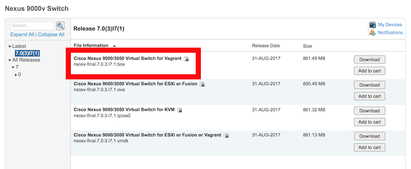

# Vagrant Box Building 

Here you will find a set of utilities and scripts designed to help simplify the creation of [Vagrant Boxes](https://www.vagrantup.com/docs/boxes.html) of network devices for use with Virtual Box.  Developers can then quickly initialize and `vagrant up` an instance of a network element to build and test code and APIs.  

### Acknowledgments 

Like many great Open Source projects, this project is built open the great work of others.  Specifically these scripts build on the foundation work available at [https://github.com/ios-xr/iosxrv-x64-vbox.git](https://github.com/ios-xr/iosxrv-x64-vbox.git)

## Getting Started 

#### Platform Support: 
These utilities are perpetually in development/beta and currently are being built and tested on MacOS.  Testing and supporting other platforms is planned, and I'd love to see contributions in this area.  

1. Clone the repo and enter the directory.  
    
    ```bash
    git clone https://github.com/hpreston/vagrant_net_prog 
    cd vagrant_net_prog/box_building 
    ```
    
1. Install [VirtualBox](https://www.virtualbox.org/), [Vagrant](https://www.vagrantup.com), and [socat](http://www.dest-unreach.org/socat/doc/socat.html).  There are several methods available, but one very easy way is using [Homebrew](https://brew.sh) for MacOS.  

    ```bash
    /usr/bin/ruby -e "$(curl -fsSL https://raw.githubusercontent.com/Homebrew/install/master/install)"
    brew cask install virtualbox
    brew cask install vagrant
    ```

1. Install [pexpect](https://pypi.org/project/pexpect/) for Python 

    ```bash 
    pip install -r requirements.txt
    ```

1. Continue with device specific steps.

## Supported Devices 

* [Cisco Nexus 9000v](#cisco-nexus-9000v) - Running the same Open NX-OS available on Nexus 9000 and 3000 platforms, the 9000v is a great platform for building and testing scripts and code for data center automation. 
* Cisco CSR 1000v *(Coming Soon)* - The CSR runs IOS XE, just like Cisco's Catalyst Switches and many routing platforms (such as ISR, ASR 1K, etc), and is a great platform for experimenting with features like Model Driven Programmability, Day Zero Technologies and Application Hosting. 
* Cisco IOS XRv *(Coming Soon)* - Running the same IOS XR code available on NCS and ASR 9K platforms, the XRv enables developers a resource for automating service provider networks.  

# Cisco Nexus 9000v

Cisco publishes a Vagrant Box for the Nexus 9000v on CCO for each release, however the published box provides an unconfigured switch that boots expecting initial configuraiton processes to continue.  Instructions for manually completing the configuration is available on [Cisco DevNet](https://developer.cisco.com/site/nx-os/docs/guides/developer-tooling/index.gsp).  

The [`nxosv_vbox_prep.py`](nxosv_vbox_prep.py) script completes the initial configuration of the 9000v, deploys a basic configuration for management and API access, and adds the typical Vagrant user account and SSH key making it ready for usage for developers.  

## Building a Nexus 9000v Box 

1. Download the source Nexus 9000v Vagrant Box from [Cisco.com](https://software.cisco.com/portal/pub/download/portal/select.html?&mdfid=286312239&softwareid=282088129).  You will need to have an account with Cisco, but no specific entitlement is requried to download the software.  

    
    
1. Generate the configured Vagrant Box (VirtualBox) by calling the script and pointing it to the downloaded source box you downloaded.  The script will provide feedback of each step and provide feedback for how to complete at the end.  

    ```bash
    python nxosv_vbox_prep.py ~/Downloads/nxosv-final.7.0.3.I6.1.box
    
    ==> Check whether "socat" is installed
    ==>   Note: An error may occur if the Vagrant environment isn't initialized, not problem
    ==> Creating Vagrantfile
    ==> Starting Vagrant Environment.
    ==>   Note: vagrant may generate an error, that is expected
    ==> Found VirtualBox VM: box_building_default_1504808984602_7700
    ==> Waiting for NX-OS to boot (may take 3 minutes or so)
    ==> Logging into Vagrant Virtualbox and configuring NX-OS
    ==> Aborting POAP
    ==> Disable Secure Password
    ==> Setting Admin Password
    ==> Confirming Admin Password
    ==> Disable Basic Sys Config
    ==> Logging in as admin
    ==> Enter Enable/Config Mode
    ==> Setting boot image
    ==> Finishing Config and Saving to Startup-Config
    ==> Waiting 10 seconds...
    ==> Powering down and generating new Vagrant VirtualBox
    ==> Waiting for machine to shutdown
    ==> New Vagrant Box Created: box_building/created_boxes/nxos_7.0.3.I6.1/nxos_7.0.3.I6.1.box
    ==> Completed! 
    ==> 
    ==> Add box to system:
    ==>   vagrant box add --name nxos/7.0.3.I6.1 box_building/created_boxes/nxos_7.0.3.I6.1/nxos_7.0.3.I6.1.box --force
    ==> Initialize environment:
    ==>   vagrant init nxos/7.0.3.I6.1
    ==> Bring up box:
    ==>   vagrant up
    ==> Note:
    ==>   Both the NX-OS SSH and NX-API username and password is vagrant/vagrant
    ```
    
1. Add the newly created box to your local Vagrant inventory.  ***The script ends with the exact command to use based on your machine, but here is an example for reference.***

    ```bash    
    vagrant box add --name type/version path_to_box.box --force 
    ```
    
1. Initialize a new Vagrantfile using the new box.  ***The script ends with the exact command to use based on your machine, but here is an example for reference.***

    ```bash
    vagrant init type/version
    ```

1. Start your environment. 

    ```bash
    vagrant up
    ```
    
    * **Note: `vagrant up` for the Nexus 9000v will likely end with an error similar to the below.  This is expected and we are working on resolving the error.  The switch has likely booted correctly and you can continue.**

        ```bash
        The configured shell (config.ssh.shell) is invalid and unable
        to properly execute commands. The most common cause for this is
        using a shell that is unavailable on the system. Please verify
        you're using the full path to the shell and that the shell is
        executable by the SSH user.        
        ```     

1. Log into your environment. 

    ```bash
    $ vagrant ssh
    
    ***************************************************************************
    *  Nexus 9000v is strictly limited to use for evaluation, demonstration   *
    *  and NX-OS education. Any use or disclosure, in whole or in part of     *
    *  the Nexus 9000v Software or Documentation to any third party for any   *
    *  purposes is expressly prohibited except as otherwise authorized by     *
    *  Cisco in writing.                                                      *
    ***************************************************************************
    n9kv1#    
    ```